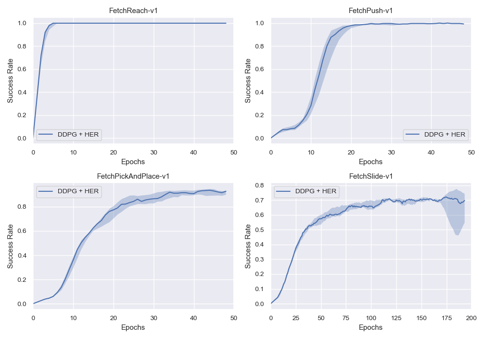
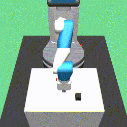
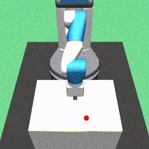
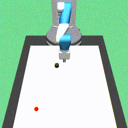

# Hindsight Experience Replay (HER)
This is a pytorch implementation of [Hindsight Experience Replay](https://arxiv.org/abs/1707.01495). 

## Acknowledgement:
- [Openai Baselines](https://github.com/openai/baselines)

## Requirements
- python=3.5.2
- openai-gym=0.12.5 (mujoco200 is supported, but you need to use gym >= 0.12.5, it has a bug in the previous version.)
- mujoco-py=1.50.1.56 (~~**Please use this version, if you use mujoco200, you may failed in the FetchSlide-v1**~~)
- pytorch=1.0.0 (**If you use pytorch-0.4.1, you may have data type errors. I will fix it later.**)
- mpi4py

## TODO List
- [x] support GPU acceleration - although I have added GPU support, but I still not recommend if you don't have a powerful machine.
- [x] add multi-env per MPI.
- [x] add the plot and demo of the **FetchSlide-v1**.

## Instruction to run the code
If you want to use GPU, just add the flag `--cuda` **(Not Recommended, Better Use CPU)**.
1. train the **FetchReach-v1**:
```bash
mpirun -np 1 python -u train.py --env-name='FetchReach-v1' --n-cycles=10 2>&1 | tee reach.log
```
2. train the **FetchPush-v1**:
```bash
mpirun -np 8 python -u train.py --env-name='FetchPush-v1' 2>&1 | tee push.log
```
3. train the **FetchPickAndPlace-v1**:
```bash
mpirun -np 16 python -u train.py --env-name='FetchPickAndPlace-v1' 2>&1 | tee pick.log
```
4. train the **FetchSlide-v1**:
```bash
mpirun -np 8 python -u train.py --env-name='FetchSlide-v1' --n-epochs=200 2>&1 | tee slide.log
```

### Play Demo
```bash
python demo.py --env-name=<environment name>
```
### Download the Pre-trained Model
Please download them from the [Google Driver](https://drive.google.com/open?id=1dNzIpIcL4x1im8dJcUyNO30m_lhzO9K4), then put the `saved_models` under the current folder.

## Results
### Training Performance
It was plotted by using 5 different seeds, the solid line is the median value. 

### Demo:
**Tips**: when you watch the demo, you can press **TAB** to switch the camera in the mujoco.  

FetchReach-v1| FetchPush-v1
-----------------------|-----------------------|
| 

FetchPickAndPlace-v1| FetchSlide-v1
-----------------------|-----------------------|
| 
